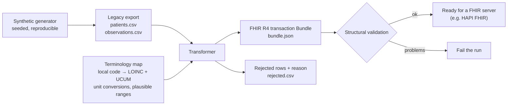
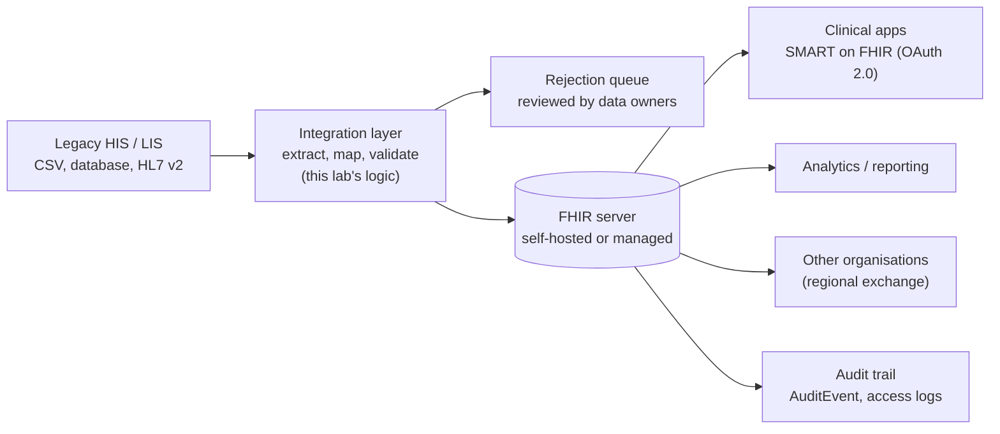

# Architecture: FHIR Interoperability Lab

> How do you get data out of an old hospital system and into a modern, standards-based form that other systems can use? This lab takes a **synthetic** CSV export from an imaginary legacy system, maps it to **HL7 FHIR R4** with **LOINC** codes and **UCUM** units, rejects what can't be mapped safely, and checks the result. No real patient data is used anywhere.

## 1. Context

Many hospitals run information systems that exchange data through flat files, custom databases or HL7 v2 messages. Each system names the same thing differently: "HR", "PULSE", "HeartRate". **Interoperability** means agreeing on:

| Layer | Standard used here | What it answers |
|---|---|---|
| Structure | **FHIR R4** resources (`Patient`, `Observation`, `Bundle`) | How is a record shaped, and how do records link? |
| Meaning | **LOINC** codes | *What* was measured (8867-4 = heart rate) |
| Units | **UCUM** | In *which unit*, written unambiguously (`mm[Hg]`, `Cel`, `/min`) |
| Transport | FHIR REST API (transaction Bundle) | How is it sent to a FHIR server? |

## 2. Lab design

**Mapping rules** (from `fhirlab/mapping.py`):

| Legacy code | FHIR result | LOINC | UCUM |
|---|---|---|---|
| HR | Observation (vital-signs) | 8867-4 Heart rate | `/min` |
| SBP + DBP at the same time | **One** blood-pressure panel with two components | 85354-9 (panel), 8480-6, 8462-4 | `mm[Hg]` |
| TEMP | Observation (vital-signs) | 8310-5 Body temperature | `Cel` |
| WT | Observation (vital-signs) | 29463-7 Body weight | `kg` |
| GLU | Observation (laboratory) | 2339-0 Glucose [Mass/volume] in Blood | `mg/dL` (mmol/L converted × 18.016) |
| HGB | Observation (laboratory) | 718-7 Hemoglobin [Mass/volume] in Blood | `g/dL` |

## 3. Target integration architecture

The legacy system keeps running. The integration layer translates its data into FHIR, and new applications read the FHIR server instead of each building its own connection to the old system.

## 4. Architecture Decision Records

### ADR-001: FHIR R4
- **Options:** HL7 v2 messages only; FHIR R4; FHIR R5.
- **Decision:** FHIR R4.
- **Why:** It's the most widely implemented FHIR version in servers, tools and national guides. R5 is newer, but support is thinner. HL7 v2 stays useful for the *inbound* feed from old systems, but it's a poor format for apps and APIs.

### ADR-002: Transaction Bundle with conditional updates (idempotent loads)
- **Decision:** Every resource is sent as `PUT Patient?identifier=<system>|<MRN>` (and the same for Observations, with a stable identifier).
- **Why:** "Create it, or update it if it already exists." Re-sending the same export never creates duplicate patients. A transaction is all-or-nothing on the server.
- **Also:** Resource IDs inside the Bundle are deterministic (UUID v5 from the identifiers), so the same input always produces byte-identical output, which makes it easy to test and compare.

### ADR-003: Blood pressure as one panel, not two observations
- **Why:** FHIR's vital-signs profile models blood pressure as a single Observation (LOINC 85354-9) with systolic and diastolic **components**. Two separate readings would be legal FHIR, but other systems expecting the profile wouldn't recognise them. A systolic value without its diastolic partner is rejected.

### ADR-004: Reject, don't guess
- **Decision:** Unknown codes, non-numeric values, unexpected units, implausible values (e.g. a temperature of 45 °C) and observations for unknown patients go to `rejected.csv` with a reason.
- **Why:** In healthcare a silently wrong value is worse than a missing one. Rejections go back to the source system's owners to fix.
- **Unit conversion only where it's exact:** glucose mmol/L → mg/dL (× 18.016). Any other unexpected unit is rejected rather than assumed.

### ADR-005: Time zones are explicit
- **Why:** Legacy timestamps are usually local time with no zone. FHIR requires a zone on `dateTime` values with a time. The transformer takes `--timezone` (e.g. `Asia/Beirut`, which handles daylight saving via the time-zone database) instead of assuming UTC silently.

### ADR-006: Lightweight validation in the pipeline, official validator before go-live
- **Decision:** `fhirlab/validate.py` checks what this pipeline could get wrong: references, codes, units, dates, required fields.
- **Why:** It's fast and has no dependencies, so it runs on every build. It is **not** a full conformance check. Before production, output should pass the official HL7 FHIR Validator against the chosen profiles.

### ADR-007: Synthetic data only, labelled as such
- **Why:** No real patient data in a public repository, ever. Every resource carries the HL7 security label `HTEST` ("test health data"), so it can't be mistaken for a real record if it ends up in a test server.

## 5. Risk register

| ID | Risk | Likelihood | Impact | Mitigation |
|---|---|---|---|---|
| R-01 | Wrong code mapping (e.g. a local code reused for two tests) | Medium | High | Mapping table reviewed by clinicians and lab staff; tests pin each mapping |
| R-02 | Unit mismatch (glucose in mmol/L read as mg/dL) | Medium | High | Unit checked on every row; only exact conversions; otherwise rejected |
| R-03 | Duplicate patients across loads | Medium | High | Conditional updates on the MRN identifier; master patient index in production |
| R-04 | Wrong time zone shifts results by hours | Medium | Medium | Explicit `--timezone`; daylight-saving-aware conversion |
| R-05 | Real patient data leaks into test systems | Low | Critical | Synthetic generator only; `HTEST` label; no production exports in repositories |
| R-06 | Unauthorized access to the FHIR server | Medium | Critical | SMART on FHIR / OAuth 2.0 scopes, TLS, audit logging, least privilege |
| R-07 | Terminology licensing (e.g. SNOMED CT for diagnoses) | Medium | Medium | LOINC and UCUM used here are free to use under their terms; check SNOMED CT licensing for the country before adding it |
| R-08 | Lightweight validation misses profile violations | Medium | Medium | Official HL7 validator before go-live (ADR-006) |

## 6. Cost

| Option | Monthly cost | Notes |
|---|---|---|
| This lab | $0 | Python standard library, runs locally or in CI |
| Self-hosted FHIR server (e.g. HAPI FHIR + PostgreSQL on a small VM) | roughly $30–60 | Rough estimate. Plus the staff time to patch, back up and monitor it |
| Managed FHIR service (AWS HealthLake, Azure Health Data Services, Google Cloud Healthcare API) | usage-based | Priced per storage and requests, and varies by provider and region. Check current pricing; it removes server maintenance |

## 7. How it is tested

Unit tests cover the glucose unit conversion, each rejection reason, time-zone formatting, patient mapping (gender, identifier, `HTEST` label, conditional `PUT`), LOINC/UCUM on observations, the blood-pressure panel, repeatable output, an end-to-end generate → transform → validate run (exactly the 5 deliberately broken rows rejected), and the validator catching a broken reference. CI also runs the full command-line pipeline with `--timezone Asia/Beirut` and keeps the output as a downloadable artifact.
